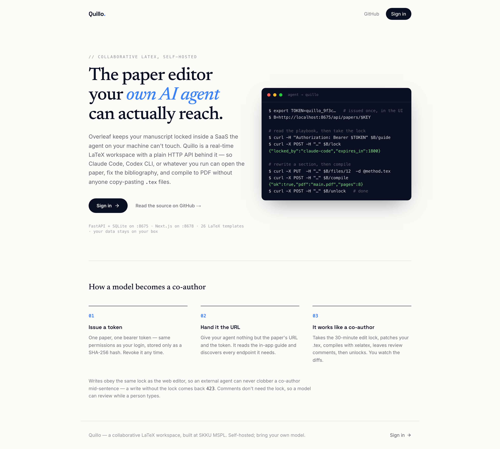
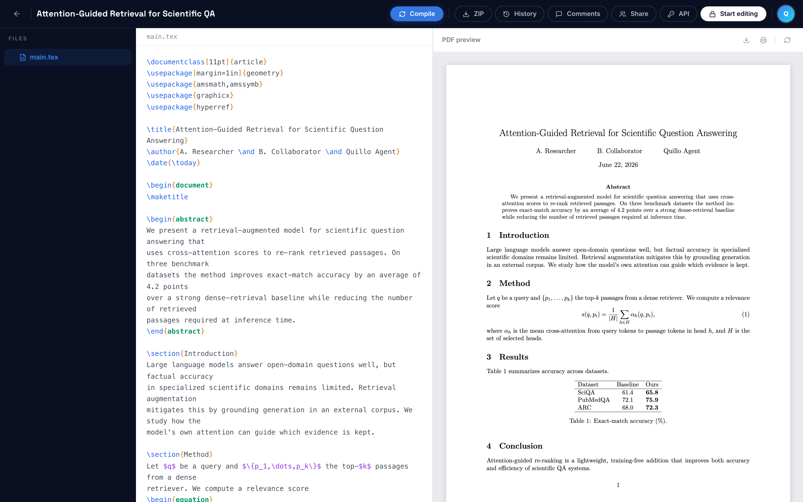
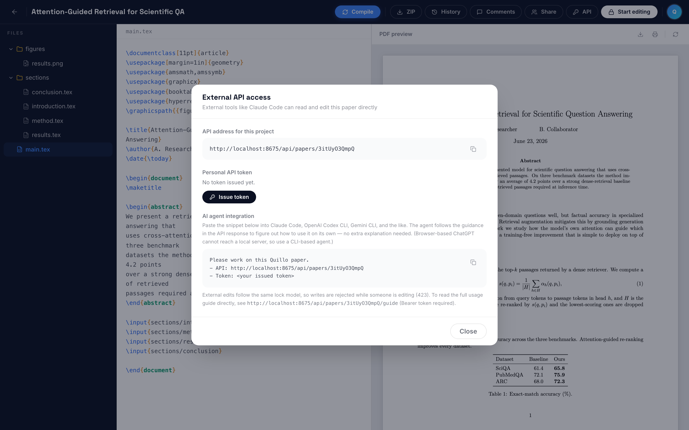

# Quillo

**A self-hosted, Overleaf-style collaborative LaTeX workspace that your own AI coding agent can read, edit, and compile — over a single URL + token.**

Overleaf is great for writing papers with people, but it locks your manuscript inside a SaaS that *your* LLM cannot reach. Quillo flips that: it is a real-time LaTeX editor **and** a clean HTTP API designed so that the agent you already use — **Claude Code, Codex CLI, Cursor, or any tool that can send an HTTP request** — can open your paper, fix the bibliography, rewrite a section, compile to PDF, and leave review comments, all without copy-pasting `.tex` files back and forth.

You bring your own model. Quillo just makes the paper reachable.



*The front door: sign in to your own instance. The terminal on the right is the actual API loop an agent runs — take the lock, edit a `.tex` file, compile, unlock — using the same account you log in with.*



*The editor: a multi-file project (`main.tex` pulling in `sections/*.tex` via `\input`, a figure under `figures/`), LaTeX source with syntax highlighting, and a live `xelatex` PDF preview — the same project an agent edits over the API.*

| Layer | Stack | Default port |
|---|---|---|
| Backend | FastAPI · SQLAlchemy 2.0 · SQLite | **8675** |
| Frontend | Next.js (App Router) · TypeScript · Tailwind | **8678** |

> Status: extracted as a standalone repo from the SKKU MSPL project. **This repository is the source of truth for the editor.**

---

## Why Quillo

- **Bring-your-own-LLM.** No vendor AI lock-in. Any agent with a bearer token can drive the editor through a documented REST API. The agent can even fetch its own instructions: `GET /api/papers/{key}/guide` returns a Markdown playbook.
- **Human + agent on the same document.** A 30-minute edit lock keeps a human and an agent from clobbering each other. Review comments don't need the lock, so an agent can leave suggestions while you keep typing.
- **Real LaTeX, real PDFs.** Server-side `xelatex` (Unicode-native, CJK-friendly) with optional `bibtex`. Every compile auto-snapshots changed files into version history with line-level diffs.
- **Self-hosted & private.** SQLite + local file storage. Your manuscripts never leave your machine. Clone, run, done.
- **Batteries included.** 26 LaTeX templates, image uploads, project ZIP export, collaborator invites, and draft → submitted → revision → published status tracking.

---

## Quick start

Requirements: **Python 3.11+**, **Node 18+**, and (for PDF compilation) a TeX distribution providing **`xelatex`** — e.g. TeX Live or MacTeX. `bibtex` is optional.

```bash
git clone https://github.com/maior/Quillo.git
cd Quillo

scripts/setup.sh      # one-time: venv + pip + editable install, npm install + build
scripts/dev.sh        # local dev (backend --reload + frontend dev; Ctrl-C stops both)
```

Then open:

- **App** → http://localhost:8678
- **Interactive API docs (Swagger)** → http://localhost:8675/docs

On first boot the backend creates `backend/quillo.db` and seeds one admin account.
Configure it via environment variables **before** the first run:

```bash
export QUILLO_ADMIN_EMAIL="you@example.com"
export QUILLO_ADMIN_PASSWORD="a-strong-password"   # default: change-me-quillo — CHANGE THIS
```

Default credentials are `admin@quillo.local` / `change-me-quillo`. **Change them before exposing the server.**

### Running in the background (production-ish)

```bash
scripts/start.sh      # builds the frontend if needed, then starts both services detached
scripts/stop.sh       # stops both (kills whatever holds :8675 / :8678)
scripts/restart.sh    # git pull + restart
```

`start.sh` runs a production build automatically when one is missing (it checks for
`.next/BUILD_ID`, so a leftover dev build is rebuilt) and writes:

- logs → `logs/backend.log`, `logs/frontend.log`
- PIDs → `logs/backend.pid`, `logs/frontend.pid`

```bash
tail -f logs/backend.log logs/frontend.log   # follow both logs
```

> In production the backend runs `uvicorn` **without** `--reload` (only `dev.sh` enables reload).
> The `logs/` directory is git-ignored.

---

## Using the web UI

1. Log in at http://localhost:8678 with your admin credentials.
2. **New paper** → you get a project that starts from a `main.tex` skeleton.
3. Edit `main.tex` (and add `sections/*.tex`, figures, `.bib`, etc.) in the LaTeX editor.
4. Click **Compile** to render a PDF preview (requires `xelatex`).
5. **Invite collaborators** by email; share **review comments** on any text selection.
6. Optionally **apply a template** (26 included) or **export** the whole project as a ZIP.

---

## Connecting your AI agent

This is the part Overleaf can't do. Any agent that can make HTTP requests becomes a co-author.



*The **API** button in the editor opens "External API access": it shows this paper's API URL, lets you issue/revoke a personal token, and gives you a ready-to-paste prompt for an agent. Hand the agent just the URL + token — it discovers everything else from the in-app guide. External edits obey the same lock model, so writes are rejected (423) while someone else is editing.*

### 1. Get a personal API token

In the web UI, issue a token (or call the API directly). The raw token is shown **once** — store it securely.

```bash
# Log in to obtain a session cookie
curl -s -c cookies.txt -X POST http://localhost:8675/api/auth/login \
  -H 'Content-Type: application/json' \
  -d '{"email":"you@example.com","password":"a-strong-password"}'

# Issue a bearer token (revokes any previous one; raw value returned only here)
curl -s -b cookies.txt -X POST http://localhost:8675/api/auth/token
# → {"token":"quillo_xxxxxxxx...","prefix":"quillo_xxx"}
```

Tokens are stored only as a SHA-256 hash and carry the **same permissions as your session**.

### 2. Point the agent at a paper

Every external URL uses an **opaque `key`** (not a sequential id). Grab the agent playbook for a paper — it documents every endpoint the agent needs, in context:

```bash
TOKEN="quillo_xxxxxxxx..."
KEY="<paper key from its URL>"

curl -s -H "Authorization: Bearer $TOKEN" \
  http://localhost:8675/api/papers/$KEY/guide
```

A typical instruction to your agent:

> "Read the Quillo guide at `http://localhost:8675/api/papers/<KEY>/guide` using bearer token `<TOKEN>`, then tighten the abstract and fix any LaTeX that fails to compile. Leave the rest of the paper unchanged."

### 3. The agent's edit loop

All write operations require holding the edit lock; writing without it is rejected with **423**.

```text
POST   /api/papers/{key}/lock                   # acquire lock (409 if someone else holds it)
GET    /api/papers/{key}/files                  # list files [{id, path, kind}]
GET    /api/papers/{key}/files/{file_id}        # read content
PUT    /api/papers/{key}/files/{file_id}        # replace content  {"content": "..."}
POST   /api/papers/{key}/files                  # create file  {"path","kind","content"}
POST   /api/papers/{key}/compile                # xelatex → PDF (422 + log on error)
POST   /api/papers/{key}/unlock                 # release lock when done
```

The lock auto-expires after 30 minutes and renews on each save. On a compile error the endpoint returns **422** with the LaTeX log — the agent reads the `!` lines, fixes the source, and recompiles. Every compile snapshots changed files into history (`GET /history`, line-level diffs, `restore`).

### 4. Review without editing

Comments don't need the lock, so an agent can critique while a human writes:

```text
GET    /api/papers/{key}/comments?file_id={id}  # status: open | resolved
POST   /api/papers/{key}/comments               # {"file_id","quote","anchor","body"}
PUT    /api/papers/{key}/comments/{id}          # {"status":"resolved"}
```

### Agent rules of the road

- The entry point is always `main.tex`. Don't delete bundled `.sty` / `.cls` files.
- Images upload via multipart `POST /files/upload` (`jpg/png/gif/webp/pdf/eps`, ≤ 20 MB).
- Compile with `?entry=<path>` to preview a single file; if it has no `\documentclass`, Quillo borrows `main.tex`'s preamble.
- Always finish by compiling (verify the PDF builds) and then unlocking.

---

## API surface

Full interactive docs at `/docs`. Highlights:

| Area | Endpoints |
|---|---|
| Auth | `POST /api/auth/login` · `POST /logout` · `GET /me` · `GET/POST/DELETE /api/auth/token` |
| Papers | `GET/POST /api/papers` · `GET/PUT/DELETE /api/papers/{key}` |
| Locking | `POST /{key}/lock` · `POST /{key}/unlock` |
| Files | `GET/POST /{key}/files` · `GET/PUT/DELETE /{key}/files/{id}` · `POST /{key}/files/upload` · `GET /{key}/export` |
| Compile | `POST /{key}/compile` |
| History | `GET /{key}/history` · `GET /{key}/history/{rev}` · `POST /{key}/history/{rev}/restore` |
| Comments | `GET/POST /{key}/comments` · `PUT/DELETE /{key}/comments/{id}` |
| Collaborators | `GET/POST /{key}/collaborators` · `DELETE /{key}/collaborators/{id}` |
| Templates | `GET /api/templates` · `POST /api/templates/{key}/preview` · `POST /api/papers/{key}/apply-template` |
| Agent guide | `GET /{key}/guide` (Markdown) |

Access control: a manuscript is visible only to its **owner + invited collaborators + admin**.

---

## Project layout

```
quillo/
├── backend/                      # FastAPI app, pip-installable package "quillo"
│   ├── pyproject.toml            # editable-install target
│   ├── quillo/
│   │   ├── main.py               # standalone app (:8675), create_app(), init_db()
│   │   ├── database.py           # Base / engine / SessionLocal / get_db
│   │   ├── models.py             # User / AuthSession / ApiToken + 5 Paper tables
│   │   ├── security.py           # PBKDF2 + session cookie & bearer token, get_current_user
│   │   ├── auth_routes.py        # /api/auth
│   │   ├── papers_routes.py      # /api/papers (CRUD, files, lock, comments, history, compile, export, guide)
│   │   ├── templates_routes.py   # /api/templates (26 templates)
│   │   └── seed_data/templates/  # LaTeX templates (manifest.json + .tex/.cls/.sty)
│   └── tests/                    # smoke tests (in-memory SQLite)
├── frontend/src/                 # Next.js app, editor components, lib/api.ts
└── scripts/                      # setup · dev · start · stop · restart
```

---

## Testing

```bash
cd backend && .venv/bin/python -m pytest      # backend smoke tests (in-memory SQLite)
cd frontend && npm run build                  # type-check + production build
```

> Don't run `next build` while the dev server is running — it corrupts `.next` and breaks CSS.

---

## Authentication model

- **Session cookie** `quillo_session` (14 days) for the web UI.
- **Bearer API token** (`quillo_…`, only its SHA-256 hash is stored) for external tools and AI agents — same permissions as the cookie.
- Tokens are per-user and singular: issuing a new one revokes the previous.

---

## Embedding Quillo in another app

The router and dependencies are exported so a host app can mount Quillo and inject its own auth/DB:

```python
from quillo import paper_router, templates_router, get_current_user, get_db, Base

app.include_router(paper_router)
app.include_router(templates_router)
app.dependency_overrides[get_current_user] = host_get_current_user  # -> (id, name, email, role)
app.dependency_overrides[get_db] = host_get_db
Base.metadata.create_all(bind=host_engine)   # creates paper_* tables in the host DB
```

> `papers_routes` queries `models.User` directly for collaborator/owner lookups, so full embedding requires reconciling the host's user table (or injecting a user lookup).

---

## Contributing

Issues and pull requests are welcome. Please run the backend tests and a frontend build before submitting.
